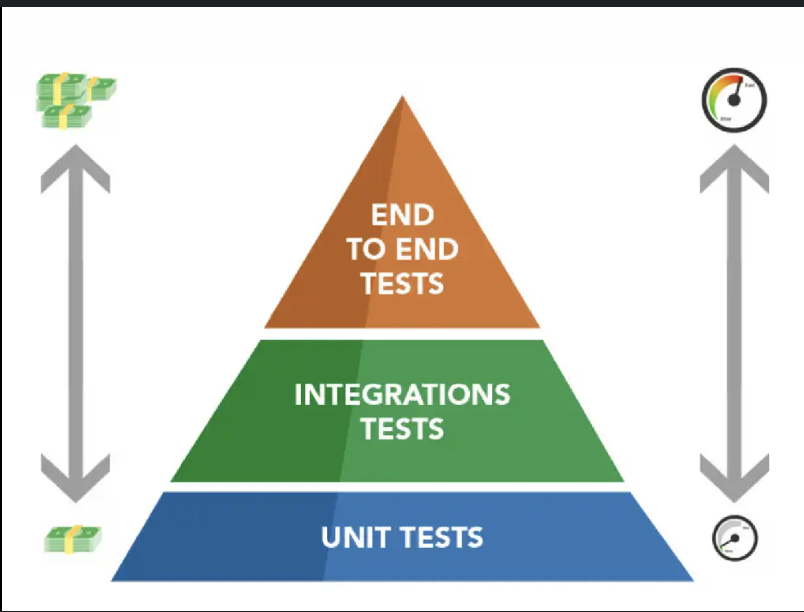
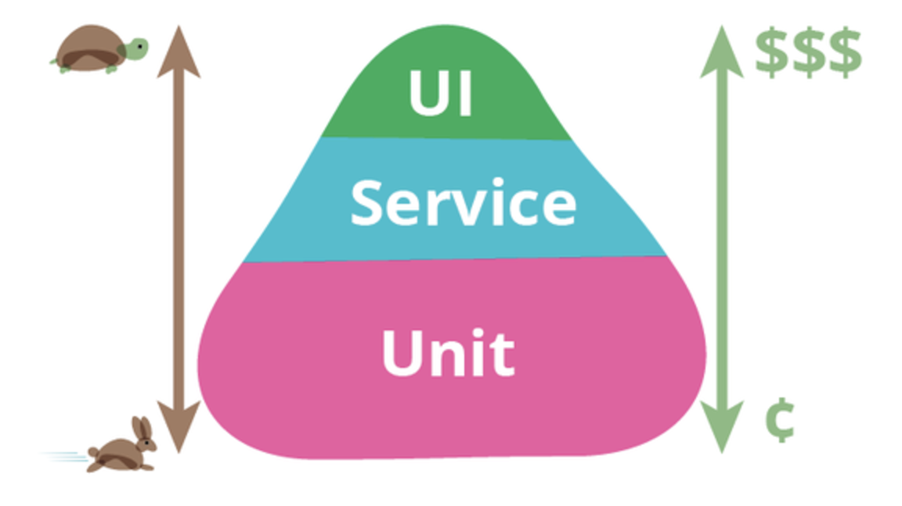
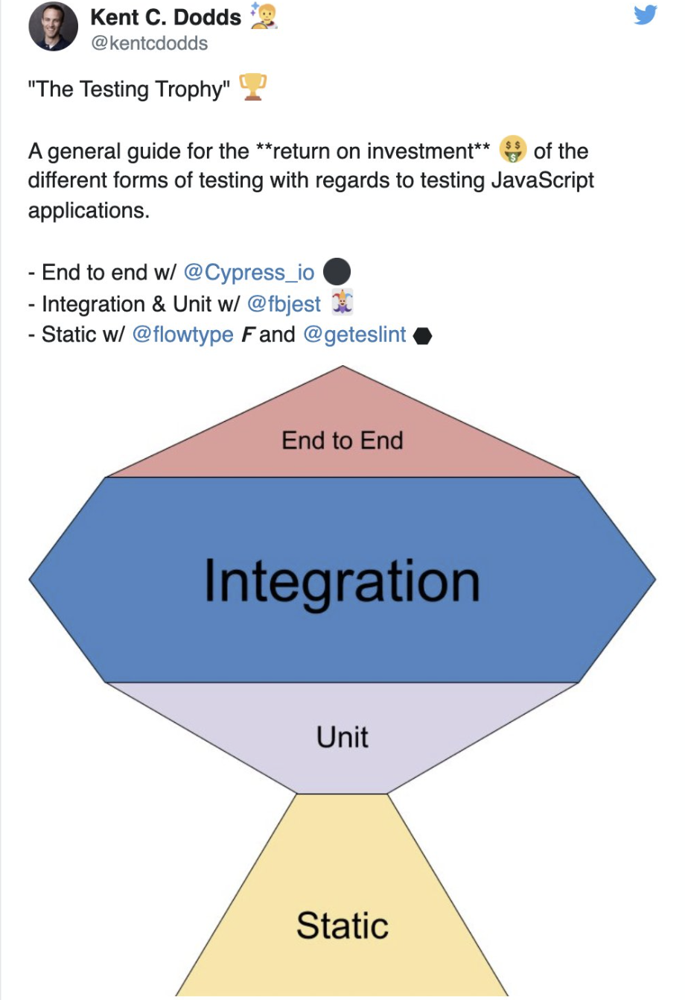

# Testes

Aqui listo os tipos de testes mais comuns utilizados

## Testes de Integração

Este tipo de teste validam componentes isolados

- Exemplo em API:
  Validar que a o GET na api retornou o status 201.
- Exemplo em um componente React:
  Validar que o evento onClick foi disparado ao clicar em um botão

## Testes End to End (E2E)

Validam oque acontece após a integração. Ele valida o fluxo do usuário e oque sua interação alterou no estado da entidade.

- Exemplo em API:
  Validar que o GET na api retornou o status 201.
  Validar que na listagem da api o registro feito está nesta listagem
- Exemplo no Frontend:
  Valida que o componente é renderizado após o clique e contem o texto e a classe css

## Testes Unitários

Este tipo de teste faz a validação do ponto de vista do cliente não importando a implementação. Validam o comportamento do seu código sem depender de iteração externa. Ele parte da premissa que a interação externa funciona. seja ela api , banco de dados,
arquivos externos.
Eles são utilizados para testar funções individuais , diferente do teste E2E que testa o fluxo completo.

## Piramide de Testes

A piramide de Testes é um conceito para representar a distribuição ideal de diferentes tipos de projetos, em uma piramide.
Há muita discussão a respeito dessa representação por que muitas vezes é um conceito
não aplicável no dia a dia e por isso diversos desenvolvedores tem opniões diferentes.

### Troféu de testes

Outro conceito de representação onde se propoe mais testes de integração
[Link do Artigo](https://kentcdodds.com/blog/the-testing-trophy-and-testing-classifications?_gl=1*1vfx89b*_ga*NzY2Mzc0ODE5LjE3MzI1ODE5NTk.*_ga_37GXT4VGQK*MTczMjYxMjM5My4yLjEuMTczMjYxNTUzNS4wLjAuMA..)

O processo em uma imagem:

Em conclusão aos artigos tudo deve ser ponderado. Parafraseando o Kent é sobre
ter um bom retorno do investimento. Onde retorno é a "confiança" que você terá do
código e investimento é o "tempo" que será utilizado para criação desses testes.
Isso ajudará a decidir onde os esforços devem ser focados.
